# Chaos Organizer

**frontend-part** -----> backend-part [here](https://github.com/Liaksej/ahj-diplom-server/main)

Веб-приложение для ведения дневника, хранения информации и поиска.

_Сохраняйте заметки, загружайте фотографии, видео, аудио, ставьте геотеги, ищите нужные заметки по тексту и скачивайте сохраненные файлы._

---
#### Разделы:

1. [Инструкция по эксплуатации]()
   - [Вход в чат]()
   - [Отправка текстовых сообщений]()
   - [Markdown-разметка текстового сообщения]()
   - [Emoji]()
   - [Удаление сообщений]()
   - [Сохранения сообщений с файлами]()
   - [Отправка геопозиции]()
   - [Поиск по сообщениям]()
   - [Воспроизведение видео/аудио]()
   - [Скачивание файлов]()
   - [Просмотр файлов по категориям]()
   - [Пагинация]()
   - [Синхронизация]()
2. [Использованные технологии]()
---

## Инструкция по эксплуатации

### Вход в Chaos Organizer

Для входа в приложение необходимо перейти по ссылке https://ahj-diplom-client-production.up.railway.app, ввести
электронную почту, выданную разработчиком и нажать на кнопку `Log in`. Перед вами откроется рабочая панель приложения.

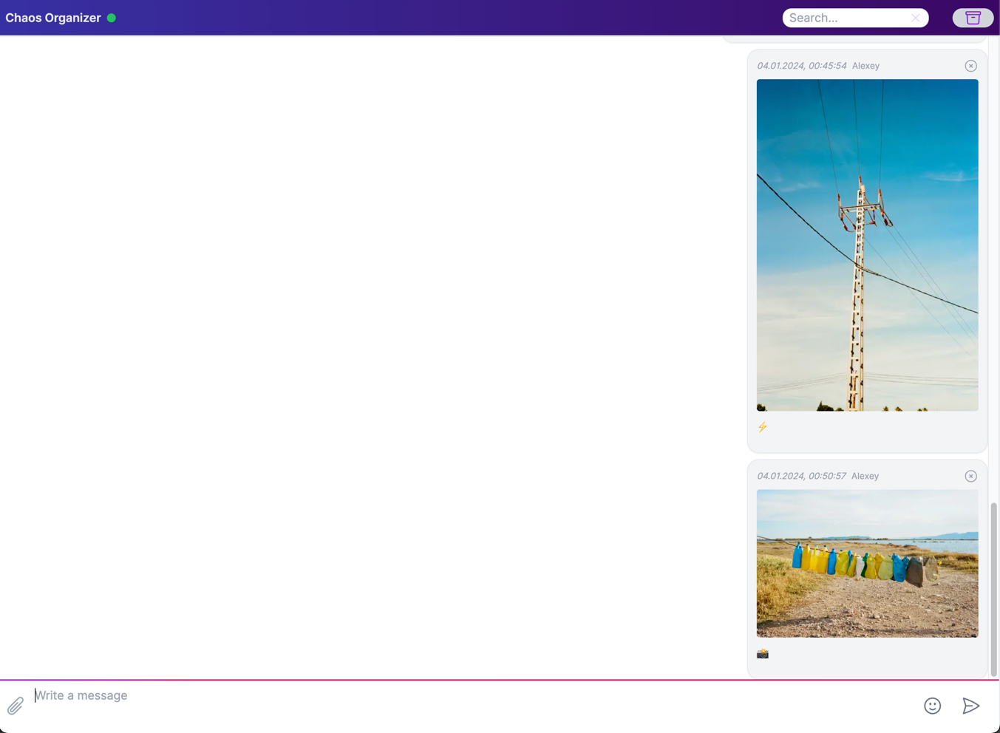

### Отправка текстовых сообщений

Отправка текстовых сообщений осуществляется через поле ввода в нижней части приложения. 
Наберите нужный текст сообщения и нажмите на кнопку с символом бумажного самолета или сочетание клавиш `Cmd/Ctrl + Enter`.

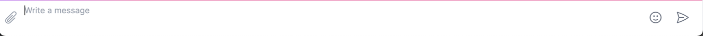

Если вы хотите написать длинный текст, поле ввода будет автоматически увеличиваться, подстраиваясь под размер вашего текста.

### Markdown-разметка текстового сообщения

Приложение поддерживает [markdown-разметку](https://www.markdownguide.org/basic-syntax/), в том числе:
* отображение ссылок и заголовков:  
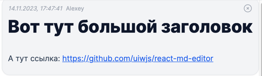
* отображение кода:  

* отображение таблиц:  
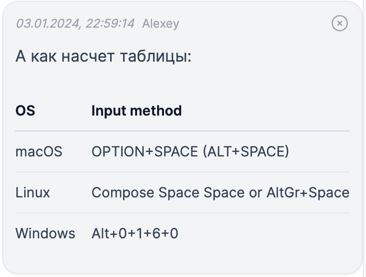
* прочую markdown-разметку.

### Emoji

Приложение поддерживает полный набор Emoji для основного текстового поля ввода. Чтобы воспользоваться
ими:
* нажмите на кнопку со смайликом рядом с кнопкой отправки сообщений;
* выберите нужные смайлы (они будут автоматически добавляться в конец строки текстового поля);
* закройте окно выбора Emoji, снова нажав на кнопку со смайликом в поле ввода снова;

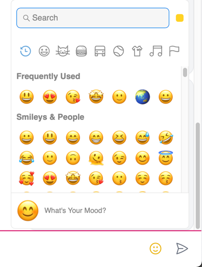

### Удаление сообщений

Для удаления сообщения нажмите крестик в правом верхнем углу опубликованного сообщения.

### Сохранения сообщений с файлами

Для сохранений файлов и мультимедиа нажмите на значок скрепки в текстовом поле ввода слева. Над скрепкой отобразится
вертикальная панель со значками (сверху вниз):
* добавления метки геолокации;
* добавления изображений;
* добавления видео-файлов;
* добавления аудио-файлов;
* добавление иных файлов;

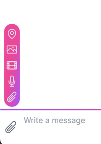

Выберите подходящий тип файла и нажмите на отвечающий за него значок.
После выбора файла на диске перед вами откроется модальное окно с названием файла, его превью
(только для изображений и видео), полем ввода текста сообщения для него (также поддерживает Markdown), кнопкой выбора геолокации, 
а также двумя кнопками `Close` для отмены действия и `Upload` для отправки сообщения с файлом на сервер.

В случае, если открытая панель выбора фалов вам не нужна, нажмите на символ скрепки в основном поле текстового ввода еще раз.

### Отправка геолокации

Приложение поддерживает возможность прикрепить к сообщению геолокационную метку с адресом или координатами (в случае недоступности адреса).
Выбор адресов выполняется через API Google Maps.

Для выбора и установки метки нажмите верхнюю кнопку вертикального меню:

Перед вами появится модальное окно с выбором геолокации с точкой, где вы находитесь. Если у вас запрещена геолокация, откроется произвольная точка на карте:

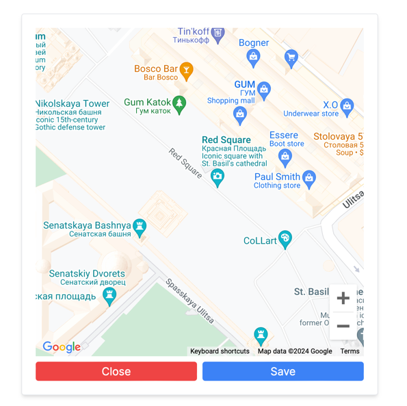

Выберите подходящее место (оно может быть не обязательно тем, где вы находитесь) и кликните по нему. Появится красная отметка, которая и будет
символизировать выбранную точку.

Нажмите кнопку `Save` для сохранения выбранной геопозиции или `Close` для отмены действия.

Если вы нажали `Save`, выбранная позиция сохранится и буде отправлена с ближайшим сообщением. Если вы хотите отменить выбор, просто нажмите на значок геопозиции в меню.

### Поиск по сообщениям

В приложении доступен поиск (фильтрация) по тексту сообщений.

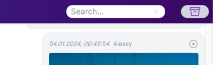

Введите в поле поиска слово, текст или несколько букв. Если сохраненные сообщения содержат их, они будут отображены на панели.

Если вы хотите очистить поиск, удалите текст в поле поиска или нажмите на крестик в правой его части.

### Воспроизведение видео/аудио

Видео- и аудио-файлы, прикрепленные к сообщению можно просмотреть/прослушать нажав соответствующие элементы плеейра:

Видео-плеер:

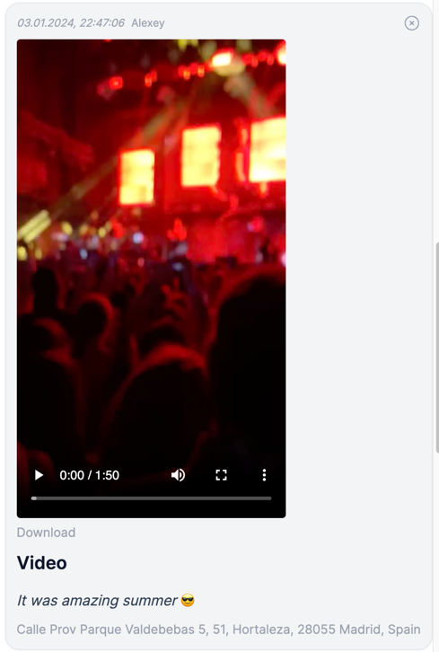

Аудио-плеер:

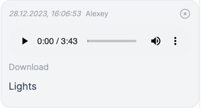

### Скачивание файлов

Вы можете скачать загруженные файлы на ваше устройство:

* Кликните по изображению, которое хотите скачать, оно откроется в отдельном окне, заем сохраните его;
* Нажмите на кнопку Download, расположенную под видео- или аудио-файлом4

* Кликните по имени файла (кроме аудио, видео и изображения);

### Просмотр файлов по категориям

Все файлы, сохраненные в приложении, можно просмотреть в боковой панели. Для ее открытия, нажмите на значок коробки
в верхнем правом углу приложения справа от поля поиска сообщений:

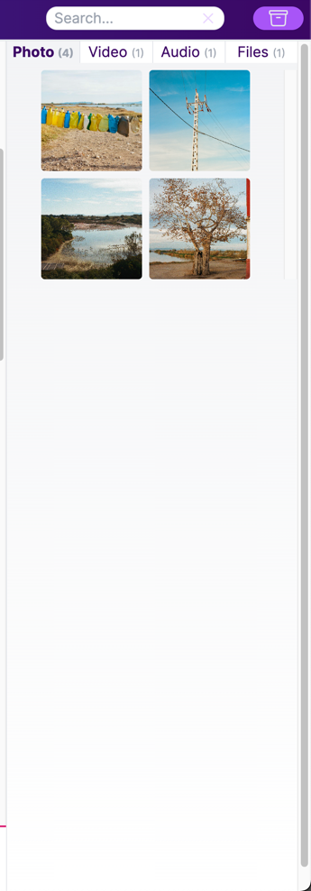

Файлы в боковой панели разделены по категориям:

* Фотографии
* Видео-файлы
* Аудио-файлы
* Прочие файлы

Все файлы отсортированы по дате (от самых новых к старым).

По клику на файл вы можете скачать его.

Чтобы закрыть боковую панель, нажмите еще раз на значок коробки в верхнем правом углу.

### Пагинация

При открытии приложения в вашем браузере загружаются изначально не все сохраненные сообщения, а последние 10. 
Чтобы загрузить более старые сообщения, пролистайте панель сообщений вверх и задержитесь на секунду в верхней точке прокрутки.
Будут подгружены более старые сообщения, но не больше 10, если нужны еще - снова проскрольте область сообщений до самой верхней точки.

### Синхронизация

В приложении можно одновременно работать на нескольких устройствах. 
Опубликовав новое сообщение, вы увидите его на другой устройстве автоматически. Удалив сообщение, вы удалите сообщение и на экране другого устройства, если оно там было отображено.

## Использованные технологии

Клиентская часть приложения написана на TypeScript. При ее разработке использованы следующие технологии:

1. [React](https://react.dev)
2. [Next.js 14](https://nextjs.org)
3. [tailwindcss](https://tailwindcss.com)
4. [emoji-picker-react](https://github.com/ealush/emoji-picker-react)
5. [react-google-maps/api](https://developers.google.com/maps)
6. [clsx](https://github.com/lukeed/clsx)
7. [react-markdown](https://www.npmjs.com/package/react-markdown)
8. [use-debounce](https://github.com/xnimorz/use-debounce)
9. [react-use-websocket](https://github.com/robtaussig/react-use-websocket)
10. [js-cookie](https://github.com/js-cookie/js-cookie)
11. [heroicons](https://heroicons.com)
12. [pnpm](https://pnpm.io)

Серверная часть приложения написана на TypeScript. При ее разработке использованы следующие технологии:

1. [Node.js](https://nodejs.org/en)
2. [Fastify](https://fastify.dev)
3. [Postgresql](https://www.postgresql.org)
4. [Prisma](https://www.prisma.io)
5. [AWS S3](https://aws.amazon.com/s3/)
6. [WebSocket](https://developer.mozilla.org/en-US/docs/Web/API/WebSocket)
7. [SSE](https://developer.mozilla.org/en-US/docs/Web/API/Server-sent_events/Using_server-sent_events)

