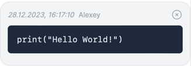

# Chaos Organizer

**frontend-part** -----> backend-part [here](https://github.com/Liaksej/ahj-diplom-server)

Web-based diary for storage and search application.

_Save notes, upload photos, videos, audio, geotag, search for notes by text and download saved files._

---
#### Topics:

1. [Manual](https://github.com/Liaksej/ahj-diplom-client/tree/main/ahj-diplom#инструкция-по-эксплуатации)
   - [Login to chat](https://github.com/Liaksej/ahj-diplom-client/tree/main/ahj-diplom#вход-в-chaos-organizer)
   - [Send text messages](https://github.com/Liaksej/ahj-diplom-client/tree/main/ahj-diplom#отправка-текстовых-сообщений)
   - [Markdown markup for text messages](https://github.com/Liaksej/ahj-diplom-client/tree/main/ahj-diplom#markdown-разметка-текстового-сообщения)
   - [Emoji](https://github.com/Liaksej/ahj-diplom-client/tree/main/ahj-diplom#emoji)
   - [Delete message](https://github.com/Liaksej/ahj-diplom-client/tree/main/ahj-diplom#удаление-сообщений)
   - [Save message with files](https://github.com/Liaksej/ahj-diplom-client/tree/main/ahj-diplom#сохранения-сообщений-с-файлами)
   - [Send geo position](https://github.com/Liaksej/ahj-diplom-client/tree/main/ahj-diplom#отправка-геолокации)
   - [Searching for messages](https://github.com/Liaksej/ahj-diplom-client/tree/main/ahj-diplom#поиск-по-сообщениям)
   - [Video/audio playback](https://github.com/Liaksej/ahj-diplom-client/tree/main/ahj-diplom#воспроизведение-видеоаудио)
   - [File downloading](https://github.com/Liaksej/ahj-diplom-client/tree/main/ahj-diplom#скачивание-файлов)
   - [Browse files by category](https://github.com/Liaksej/ahj-diplom-client/tree/main/ahj-diplom#просмотр-файлов-по-категориям)
   - [Pagination](https://github.com/Liaksej/ahj-diplom-client/tree/main/ahj-diplom#пагинация)
   - [Synchronization](https://github.com/Liaksej/ahj-diplom-client/tree/main/ahj-diplom#синхронизация)
2. [Technology stack](https://github.com/Liaksej/ahj-diplom-client/tree/main/ahj-diplom#использованные-технологии)
---

## Manual

### Login to chat

To enter the application, go to https://ahj-diplom-client-production.up.railway.app, 
enter the e-mail address given by the developer and click `Log in`. The working panel of the application will open 
in front of you.

### Send text messages

Sending text messages is done through the input field at the bottom of the application.
Type the desired message text and press the button with the paper airplane symbol or the key combination `Cmd/Ctrl + Enter`.

If you want to write a long text, the input field will automatically enlarge to fit the size of your text.

### Markdown markup for text messages

The application supports [markdown mapping](https://www.markdownguide.org/basic-syntax/), including:
* displaying links and headings: 

* code displaying:

* tab displaying:  

* other Markdown markup.

### Emoji

The app supports a full set of Emoji for the main text input field. To use them:
* click on the smiley face button next to the send messages button;
* select the desired emoticons (they will be automatically added to the end of the text field line);
* close the Emoji selection window by clicking the Emoji button in the input field again;

### Delete message

To delete a post, click the cross in the upper right corner of the published post.

### Save message with files

To save files and media, click the paperclip icon in the text input box on the left. Above the paper clip, you will see
a vertical pane of icons (top to bottom) appears above the paper clip of:
* adding a geolocation tag;
* adding images;
* adding video files;
* adding audio files;
* adding other files;

Select the appropriate file type and click on the icon responsible for it.
After selecting a file on disk, the modal window will open with the file name, its preview (only for images and videos), 
contains a input for the text message (also supports Markdown), the button for selecting geolocation, 
and two buttons `Close` for cancellation of action and `Upload` for submitting a message on the server.

In case you do not need the open file selection panel, click the paperclip symbol in the main text input field again.

### Send geo position

The application supports the ability to attach a geolocation tag with an address or coordinates to a message (in case the address is unavailable).
Addresses are selected via Google Maps API.

Press the top button of the vertical menu to select and set the label:

The modal window will appear in front of you with a geolocation selection with the point where you are. 
If you do not allow geolocation, an arbitrary point on the map will open:

Select a suitable location (it may not necessarily be where you are) and click on it. 
A red mark will appear, which will symbolize the selected point.

Press button `Save` for save chosen geo position or `Close` for cancellation.

If you click `Save`, the chosen geo position will be saved and sent with the next message. 
If you want to cancel the selection, just click on the geo position icon in the menu.

### Searching for messages

Searching (filtering) by text of messages is available in the application.

Enter a word, text, or multiple letters in the search field. 
If your saved messages contain them, they will be displayed in the panel.

If you want to clear the search, delete the text in the search box or click the cross on the right side of the search box.

### Video/audio playback

Video and audio files attached to the message can be viewed/listened to by clicking the corresponding elements of the player:

Video player:

Audio player:

### File downloading

You can download files on your device:

* Click on the image you want to download, it will open in a separate window, save it;
* Click the Download button below the video or audio file;

* Click on the file name (except audio, video and image);

### Browse files by category

All files saved in the application can be viewed in the sidebar. To open a file, tap the box icon
in the upper right corner of the application to the right of the message search field.

The files in the sidebar are categorized:

* Images
* Video
* Audio
* Other files

All files are sorted by date (from newest to oldest).

By clicking on the file you can download them.

To close the sidebar, click again on the box icon in the upper right corner.

### Pagination

When you open the app in your browser, not all your saved messages are initially loaded, but the last 10.
To download older posts, scroll up the message bar and hold for a second at the top of the scroll.
Older posts will be loaded, but no more than 10, if you need more - again scroll through the posts area to the top.

### Synchronization

You can work on multiple devices simultaneously in the app. 
When you publish a new message, you will see it on the other device automatically. 
If you delete a message, you will also delete the message on the screen of the other device.

## Technology stack

The frontend of the application is written in TypeScript. The following technologies were used in its development:

1. [React](https://react.dev)
2. [Next.js 14](https://nextjs.org)
3. [tailwindcss](https://tailwindcss.com)
4. [emoji-picker-react](https://github.com/ealush/emoji-picker-react)
5. [react-google-maps/api](https://developers.google.com/maps)
6. [clsx](https://github.com/lukeed/clsx)
7. [react-markdown](https://www.npmjs.com/package/react-markdown)
8. [use-debounce](https://github.com/xnimorz/use-debounce)
9. [react-use-websocket](https://github.com/robtaussig/react-use-websocket)
10. [js-cookie](https://github.com/js-cookie/js-cookie)
11. [heroicons](https://heroicons.com)
12. [pnpm](https://pnpm.io)

The backend of the application is written in TypeScript. The following technologies were used in its development:

1. [Node.js](https://nodejs.org/en)
2. [Fastify](https://fastify.dev)
3. [Postgresql](https://www.postgresql.org)
4. [Prisma](https://www.prisma.io)
5. [AWS S3](https://aws.amazon.com/s3/)
6. [WebSocket](https://developer.mozilla.org/en-US/docs/Web/API/WebSocket)
7. [SSE](https://developer.mozilla.org/en-US/docs/Web/API/Server-sent_events/Using_server-sent_events)

